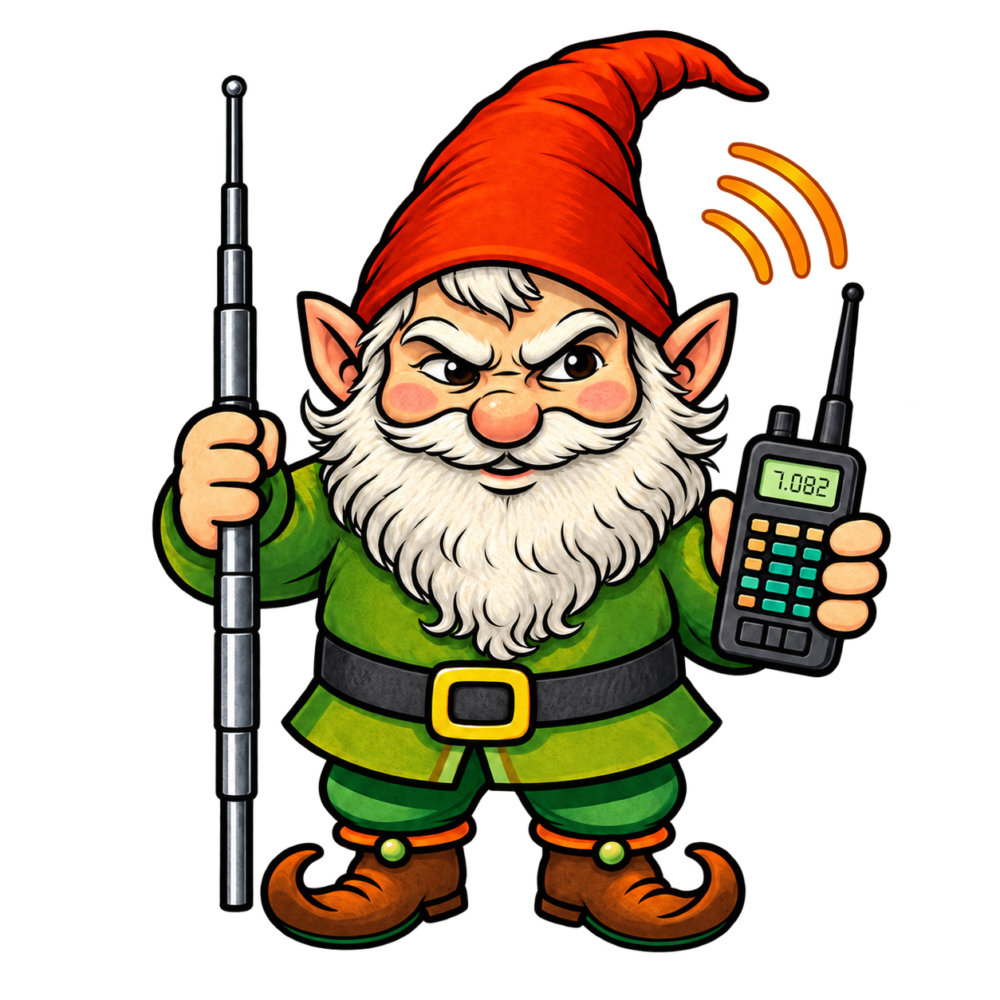

# LawnGnomeDX



**Standing Small, Talking Tall™**

LawnGnomeDX is a sound-card radio modem application for exchanging **text, files, and images over radio**. It is designed for simple keyboard messaging using a radio/audio interface, with callsign-based addressing, CQ operation, selectable RX/TX audio devices, and a built-in waterfall display.

## Features

- Send and receive typed text messages over radio
- Address transmissions to a specific callsign or use `CQ` for general calling
- Display received messages with sender, time, and signal-to-noise information
- Transfer files and images
- Select separate sound devices for radio receive and transmit audio
- Built-in waterfall display for monitoring incoming audio
- Automatic transmit queuing and cooldown handling
- Automatic or manual modem speed selection
- BPSK and QPSK data modes for binary/file transfers
- Optional receive audio AGC / clip guard
- Optional local TX echo in the receive pane
- Optional encryption with a shared Privacy Key

## Downloads

The easiest way to install LawnGnomeDX is to use the precompiled release for your operating system.

- [Windows Application](https://github.com/LawnGnomeDX/lawngnomedx.github.io/releases/download/v1.0/LawnGnomeDX.exe)
- [Ubuntu Linux Application](https://github.com/LawnGnomeDX/lawngnomedx.github.io/releases/download/v1.0/LawnGnomeDX_Ubuntu)
- [Python Source](https://github.com/LawnGnomeDX/lawngnomedx.github.io/releases/download/v1.0/LawnGnomeDX_v1_rev001-source.zip)
- [User Manual](https://github.com/LawnGnomeDX/lawngnomedx.github.io/releases/download/v1.0/LawnGnomeDX_User_Manual.pdf)
- [License](https://github.com/LawnGnomeDX/lawngnomedx.github.io/releases/download/v1.0/LICENSE.txt)
- [LawnChessDX for Windows](https://github.com/LawnGnomeDX/lawngnomedx.github.io/releases/download/v1.0/LawnChessDX_v1_rev001.zip)

You can also visit the project website at:

**https://lawngnomedx.github.io**

## What You Need

LawnGnomeDX uses modem audio, so your radio or radio interface must be connected to the computer in both directions:

- Radio receive audio must reach the computer's selected **INPUT (RX)** device.
- Computer transmit audio must reach the radio through the selected **OUTPUT (TX)** device.

The modem audio format is fixed at **48 kHz, mono, 16-bit audio**.

## Quick Start

1. Connect your radio or radio interface to the computer.
2. Launch LawnGnomeDX.
3. Open **Sound > Sound Devices**.
4. Select the correct **INPUT (RX)** and **OUTPUT (TX)** devices.
5. Enter your station callsign in **TX CALLSIGN**.
6. Enter the destination callsign in **RX CALLSIGN**, or enter `CQ`.
7. Type your message.
8. Click **SEND MESSAGE**.

If the channel is busy or a cooldown period is active, the message may show as **TX QUEUED** until LawnGnomeDX can transmit.

For normal operation, leave LawnGnomeDX running so it can receive replies.

## Callsign Addressing

**TX CALLSIGN** is your station identifier.

**RX CALLSIGN** is the destination used when transmitting.

For a direct message, enter the other station's callsign in **RX CALLSIGN**.

For general calling and reception, use:

```text
CQ
```

## Receiving Messages

Decoded messages appear in the receive pane. LawnGnomeDX can display the sender, time, and SNR reading for received traffic.

The receive controls include:

- **STOP (RX)** — reset or abandon the current receive attempt
- **COPY TEXT** — copy the latest decoded message
- **SAVE TEXT** — save receive-pane contents to a text or log file
- **ERASE TEXT** — clear the receive pane and unsaved received-file links or image previews

## File and Image Transfer

Use **IMPORT FILE** to prepare a file for transmission.

Recognized text files are loaded into the TX text box and transmitted as normal text. Other files are prepared as binary transfers.

LawnGnomeDX supports original binary files up to **8 MiB**, although a file can still be rejected if it cannot be divided into valid transmissions within the selected transmit-time limit.

Images may be reduced automatically to make them more practical to transmit.

When a file is received:

- The filename appears as a clickable link in the RX pane.
- Click the filename to choose where to save it.
- Received files are **not automatically saved**.
- Supported images can be previewed in the RX pane when image display is enabled.

## Recommended Starting Settings

A good starting configuration is:

| Setting | Recommended value |
|---|---|
| RX input | Correct radio/interface input |
| TX output | Correct radio/interface output |
| TX CALLSIGN | Your station callsign |
| RX CALLSIGN | `CQ` or the station you want to contact |
| Auto Speed | On |
| Max Transmit Time | 90 seconds |
| Data Mode | BPSK |
| RX Audio AGC / Clip Guard | On |
| Encryption | Off unless intentionally needed and lawful |

## Transmission Settings

Open **Settings > Transmission Settings** to configure:

- **MAX TRANSMIT TIME** — 60, 90, or 120 seconds
- **COOLDOWN DURATION** — waiting period before another transmission
- **DATA MODE** — BPSK or QPSK for binary/file transfers
- **SPEED** — manual symbol timing when Auto Speed is disabled
- **AUTO SPEED** — automatically selects a suitable speed

Auto Speed is enabled by default and is the recommended starting point.

## Receive Settings

Open **Settings > Receive Settings** to configure options such as:

- Show Images in RX Pane
- RX Audio AGC / Clip Guard
- RX Echo Mode

If audio is clipping before it reaches LawnGnomeDX, reduce the level at the radio, interface, or operating system. Software clip protection cannot restore information already lost to upstream clipping.

## Running From Python Source

When running LawnGnomeDX from source, live TX/RX requires the appropriate Python environment and audio dependencies.

The user manual identifies these requirements:

- Python
- PyAudio / PortAudio
- Tkinter
- NumPy

If live transmit or receive is unavailable when running from source, verify that these components are installed and working in your Python environment.

## Optional Encryption

LawnGnomeDX includes optional encryption using a shared **Privacy Key**.

Both stations must use the exact same Privacy Key to decode an encrypted transmission.

Encryption is disabled by default.

> **Legal caution:** Use encryption only where it is lawful for your radio service and location. In the United States Amateur Radio Service, messages encoded to obscure their meaning may violate 47 CFR Part 97 except for limited exceptions. This notice is not legal advice.

## Troubleshooting

### Nothing is received

Check:

- Correct **INPUT (RX)** device
- Radio/audio routing
- RX volume
- Incoming activity on the waterfall
- Callsign settings

### Transmission stays queued

The channel may be busy or a cooldown period may still be active.

### Transmission will not start

Confirm the **OUTPUT (TX)** device is correct and that the RX input is available. LawnGnomeDX uses receive audio to check the channel before transmitting.

### Audio is clipping

Reduce the input level at the radio, interface, or operating system. You can also enable **RX AUDIO AGC / CLIP GUARD**.

### File will not send

Try a smaller file or image, or increase **MAX TRANSMIT TIME**.

### Encrypted message will not decode

Make sure both stations are using the exact same Privacy Key.

## Documentation

For complete operating instructions, setup information, file transfer details, settings, and troubleshooting, see the:

[**LawnGnomeDX User Manual**](https://github.com/LawnGnomeDX/lawngnomedx.github.io/releases/download/v1.0/LawnGnomeDX_User_Manual.pdf)

## License

LawnGnomeDX is distributed under the **No-Sale Source License Version 1.0 (NSSL-1.0)**.

You may use, modify, and redistribute the software free of charge. You may not sell the software or derivative versions.

See [LICENSE.txt](https://github.com/LawnGnomeDX/lawngnomedx.github.io/releases/download/v1.0/LICENSE.txt) for the complete terms.

---

**LawnGnomeDX — Standing Small, Talking Tall™**
